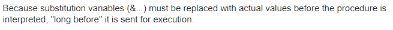

### Hospital Management System

#### Tables
1. Patient
    | PatientId (PK) | Name | Gender | Address | ContactNo | age |
    | -------------- | ---- | ------ | ------- | --------- | --- |
    Stores the information of a patient.
1. Hospital
    | HosId (PK) | hosName | HosCity |
    | ---------- | ------- | ------- |
    Stores the information of an hospital.
1. Room
    | RoomId (PK) | RoomNo | HosId (FK) |
    | ----------- | ------ | ---------- |
    Stores information about all the rooms spread across all the hospitals.
1. Doctor
    | DocId(PK) | Name | Qualification | Salary | Address | ContactNo |
    | --------- | ---- | ------------- | ------ | ------- | --------- |
    Stores the information of a Doctor.

1. MEDICAL_RECORD
    | RecordId | PatientId | DoctorId | RoomId | DateOfAdmission | Discharged |
    | -------- | --------- | -------- | ------ | --------------- | ---------- |
    Stores the medical history of a patient. A patient has only one entry in the patient table. But a patient might have multiple entires in the MEDICAL_RECORD table or none. The variable `Discharged` here can be `0` or `1`. 
        - `1` means the patient is released.
        - `0` means the patient is still in the hospital.

1. RECORD_LOG
    | RecordId | newDischarge | oldDischarge | time |
    | -------- | ------------ | ------------ | ---- |
    This is a table that stores the values of a patient being discharged. The only purpose it servers in this project is showing the usage of triggers. When a patient is discharged, or when the MEDICAL_RECORD table is updated, a new entry is inserted into the table automatically. 

#### Functions and procedures
- **Functions:**
    Main Functions:
    1. addPatientFromInput: This procedure takes information of a patient and inserts it into the `PATIENT` table.
    1. findRoomForPatientFunc: Returns the room no for a patient.
    1. findDoctorForPatientFunc: Returns the doctor for a patient.
    
    Now we also had to create some helper functions to reduce the amount of redundant code. These following functions have been used time and time again to make the project robust.
    1. checkPatientFunc: Takes a patient id as input and checks all the sites. If there exists a patient with that id it return `1`, otherwise returns `0`.
    1. MergePatient: Merges patient tables from all the differnt sites.
    1. checkDoctorFunc: Takes a doctor id as input. If there exists a doctor with that id it return `1`, otherwise returns `0`.
    1. checkHospitalFunc.sql Takes a hospital id as input. If there exists a hospital with that id it return `1`, otherwise returns `0`.
- **Procedures:**
    1. showAvailabeRooms: This procedures lists out all the available rooms spread across different branches of the hospital.
    1. showAvailableRoomNoForHos: This procedure lists out all the available rooms in a hospital given an hospital id.
    1. showPatientHosRoomNo: This procedure shows hospital and room information for a patient including all the previous records.
    1. findPatientOfAgeForHosFunc: This function takes one hospital ID & an age number as input and returns the total number of patients having greater age than the given age in the given hospital. 
    1. showTotalPatientUnderDoc: Task of this function is to take a doctor ID as input and returns the total number of patients that doctor has diagnosed.
    1. TotalRoomInAHospital: Takes name of the hospital returns total number of rooms in that hospital, prints nothing if no such hospital is found.
    1. admitPatientProc: This function takes information about a patient as input and inserts it into the patient table.
    1. dischargePatientProc: Discharges a patient. All it does is sets the value of discharge to `1`.
    1. addPatientFromInputToSiteOneProc: Takes information of a patient and adds a patient to another site.
    1. showPatientInfo: Shows information about a patient
- **Additional**:
    1. all_patient_view: This view shows all the patients in all of the sites combined.
    1. triggerRecord: This trigger adds a log to the RECORD_LOG table upon update on the medical_record table.
    1. trigger pt_trig: After updating the contact no column of patient table for each row, log_updel table will store the new values of contact no, old values and the system date.
    1. trigger doc_trig: After insertion into the doctor table for each row, prints “data  inserted!”.
    1. trigger hos_trig: After deletion in hospital table for each row, prints “data deleted!”.

#### User and Admin
- Admin can insert and manipulate data in all of the tables. When it comes to `Patient` table, an admin have full access to the table of all the sites. It is made this way so that we can merge two patient tables from different sites. PatientId is the primary key, and is referenced from other table. So, say to be able to insert into `medical_history` table, the patientId must be present in the table, and to achieve that we have to merge.
Now for rest of the tables the data are readonly to the admins of other sites.
- As an user, an user can only view information about the hospital, himself, doctors and rooms available.

#### My Contribution and Perspective on the project
This project solely focuses on the implementation of distributed database and plsql. Therefore the structure of this project is not similar to the way Hospital Management in practice should be.

Along with the some main functions, I introduced the helper functions to enhance reusability. The helper functions are neatly done keeping in mind the data being distributed.
- CheckPatient
- CheckDoctor
- CheckHospital
- CheckRoom

We made fragments of the `Patient` table. Therefore for the `CheckPatient` function it search all the sites.
I also made sure that now two patientId were similar. After the implementation of the `insertPatient` function tables in two sites looks like this.

For Site 1:

| PatientId (PK) | Name  | Gender | Address   | ContactNo | age |
| -------------- | ----- | ------ | --------- | --------- | --- |
| 1              | dipta | Male   | something | 123       | 23  |
| 3              | nabil | Male   | something | 123       | 23  |
| 4              | arnob | Male   | something | 123       | 23  |

For Site 2:
| PatientId (PK) | Name   | Gender | Address   | ContactNo | age |
| -------------- | ------ | ------ | --------- | --------- | --- |
| 2              | Broti  | Female | something | 123       | 23  |
| 5              | Tonmoy | Male   | something | 123       | 23  |

The primary key will always maintain the **sequence**.

I created the following functions/procedures.
- addPatientFromInput: This makes sure that the primary key follows the above mentioned sequence.
- addPatientFromInputToSiteOneProc: I also made sure it also follow the sequence.
- admitPatientProc: To make this function work I had to merge two patient table. And thus I ended up creating another helper function `mergePatient` function.
- MergePatient: I used cursor to merge two tables. This makes the runtime slower, but makes sure there's **no redundancy** in the data and the data is **consistent**.
- dischargePatientProc: As there's an admit function, it means there's bound to be a procedure that releases a patient. So I added it. It uses **Exception**. This is the format of the function: `dischargePatient(patientId)`
  - If there's no such patient with the given `patientId` then `noSuchPatient` exception is raised.
  - If there's no record for that patient then `noPreviousRecord` exception is raised. This is to show the 
- triggerRecord: I added the trigger mostly to show the implementation of trigger in a project and how it can help. We can find out the time during when a patient has been admitted a hospital later if we need, although it's not present in the database directly. But using this trigger we can find it out from the `record_trigger` table.
- all_patient_view: This is just to view all the information of all the patients out there.
- showAvailableRooms: I also took care of multiple sites. First I find out all the patients who are not discharged (where the value of `discharge` is 0), then just cut out all the rooms those patients are in and print the rest of the rooms.

The troubleshooting:
- I first thought to create a main sql file and then run all the other functions through it. But it turned out that it's not possible due to plsql requiring the values of the variables during compile time. This is the [StackOverflow](https://stackoverflow.com/questions/36372563/pl-sql-accepting-input-in-if-else) post regarding the same problem but with no solution thus far.

- For the `rooms` table I could've just used roomNo and hosId as the composite primary key. But it's not possible to reference both of them from outside the table as I can only reference one at a time, and none of these two keys uniquely identify the whole table.

I also tweaked things here and there to make it look more practical. For example I added the constraint `Male`, `Female` for the patient gender. I also mostly tried to design the structure of the database. Although the structure of the database is not really practical, yet I feel like it has been able to demonstrate the core concept of distributed database and plsql workflow.
